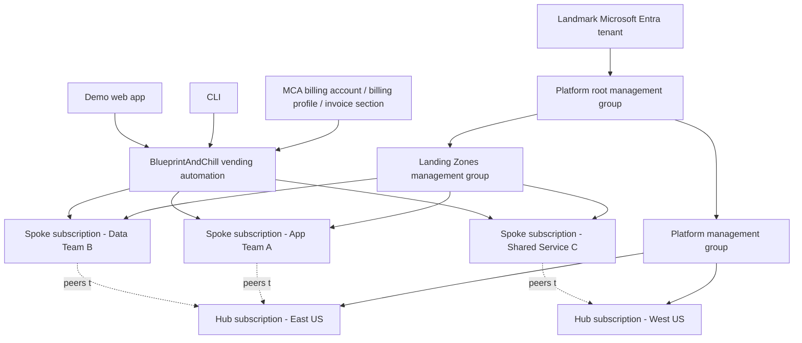
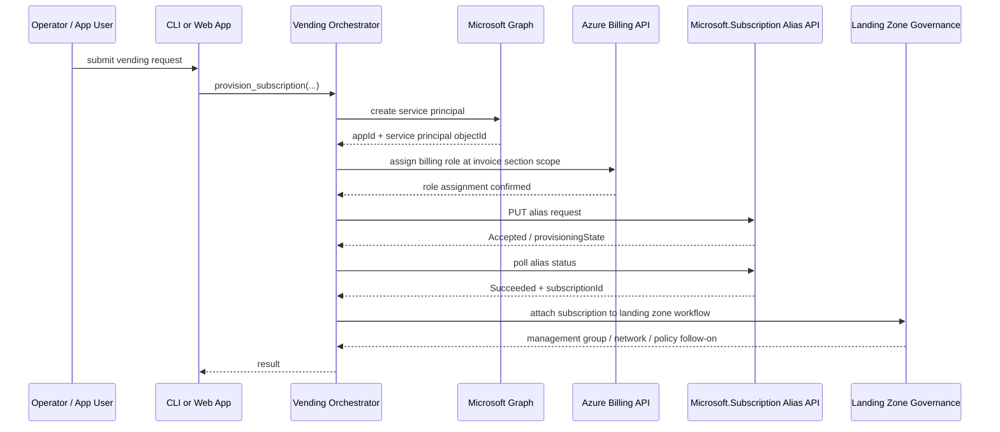

# BlueprintAndChill

Production-grade framework and scaffold for **BlueprintAndChill**, an **Azure Landing Zone (ALZ)** and **subscription-vending accelerator** for customer **Landmark**.

This repository's **first Pull Request (PR)** is intentionally **not a finished platform**. It is the **foundational framework**: production-grade repo layout, domain boundaries, command-line interface (CLI), demo web application, Infrastructure as Code (IaC) scaffolds, unit tests, and source-backed architecture notes. **Live Azure calls are deliberately stubbed with explicit TODOs** where real Microsoft Graph, Azure Billing, and Azure subscription-management integrations will be wired in later.

The project target is a repeatable platform where Landmark can:

- run a **hub-and-spoke architecture per Azure region**
- maintain a **central landing-zone hub subscription** for shared services in each region
- **vend new spoke subscriptions** under governance
- attach those subscriptions to the correct **management group** and **regional landing zone**
- eventually trigger subscription creation from a new **Microsoft Customer Agreement (MCA) invoice section**
- offer a **demo shopping experience** through a Python web app with **Microsoft Entra ID** sign-in and a catalog of deployable landing-zone options

The architecture and API contract are grounded in **Microsoft Cloud Adoption Framework (CAF)** and **Azure Landing Zones (ALZ)** guidance, as documented in `docs/architecture.md`.

## What "excellence" looks like

For this accelerator, "excellence" means the platform follows Microsoft's documented operating model rather than improvising around it:

- **Azure Landing Zones** provide the standardized foundation for scale, governance, connectivity, security, and platform automation.
- **Subscriptions** are treated as the primary unit of workload isolation and management.
- **Management groups** are used primarily for policy and governance inheritance.
- **Hub-and-spoke** is the regional network pattern for shared services and workload subscriptions.
- **Subscription vending** is automated, policy-driven, and least-privilege.
- **Billing-scope automation** uses the exact MCA billing APIs and role assignment model required for subscription creation.

For the detailed source-backed write-up, see:

- [`docs/architecture.md`](docs/architecture.md)

## What this PR is

This PR delivers a **production-grade framework/scaffold**, specifically:

- Python package layout under `src/`
- installable CLI entrypoint
- vending orchestration boundary and tests
- invoice-section event-trigger skeleton
- demo web app and shopping flow scaffold
- Bicep scaffold for tenant, management-group, networking, policy, and vending shape
- Terraform scaffold for the same landing-zone concerns
- architecture brief documenting the Microsoft guidance and API contract
- explicit TODO seams where real Azure integrations will be attached later

This PR **does not** yet deliver a complete live Azure implementation. In particular, the following remain intentionally stubbed:

- live **Microsoft Graph** application / service principal creation
- live **billing role assignment** at MCA invoice-section scope
- live **subscription alias create + poll** against Azure
- live **Event Grid / Azure Function** trigger plumbing
- live **Entra ID app registration** and production auth setup for the demo web app
- live persistence for orders, provisioning records, and idempotency tracking
- final policy definitions / initiatives approved by Landmark governance
- end-to-end peering and post-vend workload bootstrap

That is deliberate. This repository is meant to be safe to clone, inspect, test, and extend without pretending it already has production credentials or tenant-specific configuration.

## Landmark target architecture

Landmark's target operating model is **regional hub-and-spoke**:

- one **central landing-zone hub subscription per region**
- multiple **spoke subscriptions** vended for workloads, teams, or environments
- governance enforced through **management groups** and **Azure Policy**
- platform-managed identity and automation at the tenant / billing layers
- workload ownership delegated at the vended subscription scope

### Conceptual layout

### Regional hub responsibilities

Each regional hub is expected to host shared landing-zone services such as:

- shared connectivity
- shared security controls
- shared DNS / private endpoint patterns
- optional Azure Firewall, Bastion, gateway, and diagnostics patterns
- network peering target for vended spoke subscriptions

The current Bicep and Terraform modules model this **shape** and input contract without claiming every shared service is fully implemented yet.

## End-to-end subscription-vending flow

BlueprintAndChill is designed around the following vending sequence for Landmark.

### Intended production flow

1. A new workload request is created:
 - manually through the CLI
 - through the demo web app
 - eventually from an MCA invoice-section creation event

2. The vending workflow gathers request data:
 - alias name
 - subscription display name
 - workload type
 - billing scope
 - target management group
 - target region / hub
 - catalog choices for landing-zone components

3. The workflow creates or references a **service principal** for the automation path.

4. The workflow assigns that principal the **exact MCA billing role** required at the invoice-section scope to create subscriptions.

5. The workflow calls the **subscription alias API** to request creation of the subscription.

6. The workflow polls until Azure reports a terminal provisioning state.

7. The new subscription is associated to the correct **management group** and linked into the landing-zone topology.

8. Follow-on deployment layers apply the chosen landing-zone and workload scaffolding.

### Framework implementation status in this PR

The repo already models this sequence in code and tests, but the live Azure boundaries are still stubbed. That means:

- orchestration order exists
- request / result modeling exists
- test coverage exists for sequencing and alias polling behavior
- CLI and event adapters exist
- demo web app flow exists
- real tenant-specific Azure client wiring is still a TODO

### Sequence diagram

## Exact Azure APIs and role shape used by this framework

This repository is scaffolded around the official Azure control-plane pattern described in `docs/architecture.md`. The architecture brief is the current source of truth for the exact contract this codebase is being shaped to implement.

### Billing scope shape

The vending workflow expects an **MCA invoice-section billing scope** shaped like:

- `/providers/Microsoft.Billing/billingAccounts/{billingAccountName}/billingProfiles/{billingProfileName}/invoiceSections/{invoiceSectionName}`

The CLI already accepts this as `--billing-scope`.

### Subscription creation API shape

The code and tests are built around the **Microsoft.Subscription alias** pattern, using the alias endpoint and polling model. The tests explicitly validate the alias API version and request construction in the subscription-creation slice.

### Billing role assignment

The framework assumes a dedicated automation identity receives the exact **billing-scope role** required to create subscriptions at the invoice-section scope before alias creation is attempted.

### Service principal creation

The orchestrator boundary is already structured to create or obtain a service principal before billing-role assignment and subscription creation.

### Current implementation note

In this first PR, these integrations are **stubbed** in code with explicit TODO markers. The framework documents and tests the sequence, but it does not make live Azure calls yet.

## Repository walkthrough

The repository is organized so the production implementation can be filled in incrementally without rewriting the shape.

### Top-level layout

- `README.md`
 This getting-started document.

- `LICENSE`
 Existing repository license. **This PR preserves the LICENSE and does not modify it.** Any distribution, reuse, or contribution expectations remain governed by that existing file.

- `docs/architecture.md`
 Source-backed architecture brief describing CAF / ALZ grounding, management-group guidance, hub-and-spoke target shape, and the subscription-vending API contract.

- `pyproject.toml`
 Packaging, tooling, console-script entrypoint, linting, typing, and test configuration.

- `src/blueprintandchill/`
 Python package source.

- `infra/bicep/`
 Bicep scaffold modules for ALZ-oriented deployment structure.

- `infra/terraform/`
 Terraform scaffold modules for ALZ-oriented deployment structure.

- `tests/`
 Mocked-only unit tests for the vending core.

### Python package structure

- `src/blueprintandchill/__init__.py`
 Package metadata.

- `src/blueprintandchill/cli/`
 CLI entrypoints. The main operational command here is `provision-subscription`.

- `src/blueprintandchill/events/`
 Event-adapter skeleton for mapping an invoice-section event into a vending request.

- `src/blueprintandchill/web/`
 Demo web application routes and templates for the shopping flow.

- `src/blueprintandchill/vending/`
 The core subscription-vending orchestration and slice functions. This is where real Azure SDK / REST client wiring will land in later PRs.

- `src/blueprintandchill/config`
 Environment-driven settings for local and future deployed execution paths.

### IaC structure

#### Bicep

- `infra/bicep/managementGroups.bicep`
 Tenant-scope scaffold for ALZ-style management-group hierarchy.

- `infra/bicep/hubNetworking.bicep`
 Subscription-scope scaffold for a regional hub virtual network and reserved subnet layout.

- `infra/bicep/policyAssignments.bicep`
 Tenant-scope scaffold for baseline policy assignment shape.

- `infra/bicep/subscriptionVending.bicep`
 Tenant-scope scaffold describing the vending contract and handoff points.

#### Terraform

- `infra/terraform/main.tf`
 Root scaffold composing ALZ-oriented concerns.

- `infra/terraform/variables.tf`
 Shared input contract for Terraform-based composition.

- `infra/terraform/modules/hub_networking/`
 Regional hub networking module scaffold.

- `infra/terraform/modules/subscription_vending/`
 Subscription-vending module scaffold with TODOs for live billing-role and alias implementation.

### Tests

- `tests/test_subscriptions.py`
 Verifies alias PUT path, API-version usage, and poll-loop success / failure behavior.

- `tests/test_orchestrator.py`
 Verifies orchestration order:
 service principal → billing role → subscription creation.

## Getting started

## Prerequisites

You need:

- Python **3.11+**
- `pip`
- a local virtual environment tool of your choice
- optionally, Azure CLI for later live implementation work
- optionally, Bicep CLI and Terraform CLI if you want to inspect or validate the IaC scaffold

## Clone the repository

 git clone https://github.com/Sleepyreaper/BlueprintAndChill.git
 cd BlueprintAndChill

## Create and activate a virtual environment

### macOS / Linux

 python3 -m venv.venv
 source.venv/bin/activate

### Windows PowerShell

 py -3.11 -m venv.venv.\.venv\Scripts\Activate.ps1

## Install the package

For normal local development:

 pip install -e.

For development tooling as well:

 pip install -e ".[dev,test,runtime]"

This installs the console script:

 blueprintandchill

## Run tests

 pytest

The current test suite is mocked-only and should not require live Azure credentials.

## CLI usage

The repository exposes a Typer-based CLI.

### Show help

 blueprintandchill --help

### Show command help

 blueprintandchill provision-subscription --help

### Current primary command

The foundational command is:

 blueprintandchill provision-subscription

This command is the operator-facing front door for a vending request. It is intended to accept values such as:

- alias name
- subscription display name
- workload classification
- billing scope
- management group target
- regional context

The exact accepted flags are defined in `src/blueprintandchill/cli/main.py`.

### Example usage

 blueprintandchill provision-subscription \
 --alias landmark-spoke-001 \
 --display-name "Landmark - Spoke 001" \
 --workload Production \
 --billing-scope /providers/Microsoft.Billing/billingAccounts/ACCT/billingProfiles/PROF/invoiceSections/SECT

### What happens today

In this framework PR, the CLI:

- parses and validates request input
- loads environment-driven settings
- constructs collaborator boundaries for the orchestrator
- reaches explicit stub seams for future Azure client wiring
- fails loudly and intentionally if you try to run against unimplemented live integrations

That is by design. The command is meant to prove the execution path and contract, not to silently fake production Azure provisioning.

### What will happen in later PRs

The CLI will eventually:

- authenticate using `DefaultAzureCredential`
- create or resolve an Entra application / service principal
- assign the required billing role at the MCA invoice-section scope
- call the alias API to create the subscription
- poll until provisioning completes
- associate the subscription to the correct management group
- kick off landing-zone bootstrap for the new spoke

## Configuration

The CLI and future automation flows read environment-specific values through the project settings layer.

Typical values for later live implementation will include:

- tenant ID
- billing account name
- billing profile name
- invoice section name
- default region
- target management group IDs
- application / auth configuration for the web app

Because this PR is scaffold-first, the code is careful not to require live secrets at import time.

## Demo web app

The repository contains a **demo shopping application** under `src/blueprintandchill/web/`. It is meant to show Landmark the intended user experience for selecting what gets deployed into the landing zone and into each new subscription.

### What the demo app does today

The current shopping flow provides:

- a catalog page
- a JSON order submission path
- a receipt / result page
- a local stub that simulates a provisioning outcome

The key route module is:

- `src/blueprintandchill/web/routes.py`

The receipt template is:

- `src/blueprintandchill/web/templates/result.html`

### Important status note

The demo app is **not yet wired to live Azure vending**. Its order flow currently uses a local stub instead of the real vending orchestrator. This is documented directly in the route module and template.

### Intended production experience

Landmark's eventual experience is:

1. Sign in with **Microsoft Entra ID**
2. Browse landing-zone / spoke deployment options
3. Select workload type, region, and baseline components
4. Submit a request
5. Trigger the same vending orchestration path used by the CLI
6. View real provisioning status and resulting subscription details

### Running the demo app locally

This repository already contains the web package and route module, but depending on the exact state of the application factory in your branch, you may need to add or finalize the local ASGI startup entrypoint in a follow-on implementation PR.

If an app factory is present, the typical local run command will be:

 uvicorn blueprintandchill.web.app:app --reload

or, if the branch exposes a factory pattern:

 uvicorn blueprintandchill.web.app:create_app --factory --reload

If your local branch does not yet include the final app bootstrap module, treat the current web assets as a scaffolded demo surface awaiting the last wiring step.

### Entra ID note

Landmark specifically wants **Entra ID login**. This repository's framework is shaped for that requirement, but the production authentication configuration is still a TODO for a later PR. That future work will include:

- app registration
- redirect URI configuration
- client secret or federated identity strategy
- session / token handling
- route protection
- deployment configuration for Azure Web App

## Invoice-section trigger scaffold

BlueprintAndChill is designed to support automation that starts when a new **MCA invoice section** appears.

The repository includes an event adapter scaffold at:

- `src/blueprintandchill/events/invoice_section_handler.py`

### What it does today

- defines the typed event boundary
- parses an inbound event envelope
- maps event payload into a provisioning request through an injectable builder
- hands off to the orchestrator boundary

### What is still TODO

- real Azure Event Grid or equivalent event source integration
- function-host wiring
- identity / permissions for the event handler runtime
- idempotency persistence for duplicate event delivery
- dead-lettering / operational error handling

This means the event path is currently a **contract and adapter scaffold**, not a live cloud integration.

## Infrastructure as Code scaffold purpose

The Bicep and Terraform directories exist to show the intended landing-zone and vending shape from day one.

They are not throwaway samples. They are the **foundational IaC contract** for later implementation work.

### Why both Bicep and Terraform exist

Landmark may need flexibility in how the accelerator is consumed or extended. Providing both scaffolds early does three useful things:

- makes the architecture explicit
- clarifies scope boundaries across tenant, management group, and subscription concerns
- prevents the repo from hardcoding one implementation path before Landmark confirms delivery preferences

### What the IaC scaffold covers

- management-group hierarchy shape
- regional hub networking shape
- baseline policy assignment shape
- subscription-vending inputs and outputs
- metadata / tagging conventions
- explicit TODO seams for tenant-specific live implementation

### What it does not claim yet

- finished enterprise policy library
- live billing-role assignment resource support where providers do not cleanly expose it
- final networking design for every shared service
- fully automated post-vend application onboarding
- production-tested tenant-specific values

In other words, the IaC in this PR is **purpose-built scaffold**, not fake completeness.

## Suggested local workflow

A practical way to explore this repo is:

1. Read `docs/architecture.md`
2. Install the package
3. Run `pytest`
4. Inspect CLI help
5. Review the web shopping routes and templates
6. Review Bicep and Terraform scaffolds side by side
7. Identify the next implementation seam you want to fill:
 - Graph client wiring
 - billing role assignment
 - alias create / poll
 - Entra ID web auth
 - Azure Function event trigger
 - management group association
 - post-vend hub peering / bootstrap

## What is stubbed right now

For clarity, the following are explicitly stubbed or framework-only in this PR:

- live Azure SDK client construction
- Microsoft Graph application / service-principal creation
- Azure Billing role assignment
- Microsoft.Subscription alias execution
- event-source subscription plumbing
- demo app auth and persistence
- final production deployment path for Azure Web App
- completed post-vending landing-zone association workflow

The repository uses **explicit TODO markers** instead of silently faking any of that behavior.

## What comes next

The most logical next implementation PRs are:

1. **Real Azure identity wiring**
 - use `DefaultAzureCredential`
 - construct Graph, Billing, and Subscription clients cleanly

2. **Live billing-role assignment**
 - implement the exact MCA invoice-section role-assignment call
 - ensure least-privilege and idempotency

3. **Live alias-based subscription creation**
 - execute alias PUT
 - poll terminal provisioning state
 - return subscription ID and provisioning status

4. **Management-group association and landing-zone bootstrap**
 - place the subscription correctly
 - trigger network / policy / baseline deployment

5. **Demo web app authentication**
 - add Microsoft Entra ID sign-in
 - protect routes and persist request records

6. **Event-driven automation**
 - complete invoice-section event trigger implementation
 - add idempotency and operations visibility

7. **Production deployment**
 - deploy the web app to Azure Web App
 - define CI/CD and environment promotion

## License

This repository already includes a `LICENSE` file. This PR and this README **preserve that LICENSE without modification**. Refer to the existing `LICENSE` file for the governing terms.

## Quick reference

### Read first

- [`docs/architecture.md`](docs/architecture.md)

### Python entrypoints

- `src/blueprintandchill/cli/main.py`
- `src/blueprintandchill/events/invoice_section_handler.py`
- `src/blueprintandchill/web/routes.py`

### IaC scaffold

- `infra/bicep/`
- `infra/terraform/`

### Tests

- `tests/test_subscriptions.py`
- `tests/test_orchestrator.py`

## Status summary

BlueprintAndChill is currently a **production-grade framework and scaffold** for Landmark's Azure Landing Zone and subscription-vending accelerator.

It already provides:

- architecture grounding
- repo structure
- CLI surface
- web demo surface
- event adapter shape
- IaC scaffolds
- tests for core vending sequencing

It intentionally stops short of live Azure execution until the next implementation PRs wire in the real APIs, credentials, and tenant-specific configuration.