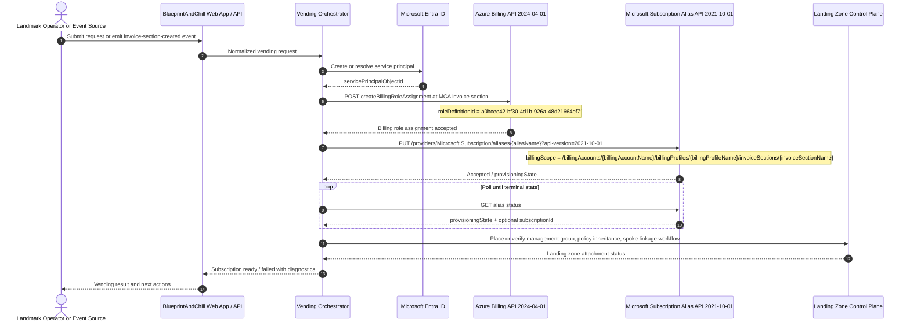

# BlueprintAndChill Architecture Baseline

## Purpose

BlueprintAndChill is the foundational framework for Landmark's Azure landing zone and subscription-vending accelerator. This baseline defines the production-grade target architecture, governance boundaries, and API-backed subscription-vending mechanism. It is intentionally scaffold-oriented: live tenant IDs, management group names, billing identifiers, event sources, and deployment automation bindings are environment-driven TODOs, not hardcoded implementation claims.

This framework aligns to Microsoft Cloud Adoption Framework (CAF), Azure Landing Zones (ALZ), and Azure Well-Architected operational excellence guidance:
- CAF positions Azure landing zones as the scalable, modular foundation for governed cloud adoption and recommends a management group hierarchy plus separate platform and application landing zones.
- ALZ recommends shared platform subscriptions for connectivity, identity, management, and security, with application subscriptions inheriting policy and RBAC from management groups.
- Subscription vending is the recommended pattern for standardized, governed, programmatic issuance of application landing zones.
- Operational excellence means automation-first provisioning, visible operations, clear ownership, safe deployments, and continuous improvement.

Source baseline:
- CAF landing zones and platform/application separation: https://learn.microsoft.com/azure/cloud-adoption-framework/ready/landing-zone/
- CAF management groups guidance: https://learn.microsoft.com/azure/cloud-adoption-framework/ready/landing-zone/design-area/resource-org-management-groups
- CAF subscription vending: https://learn.microsoft.com/azure/cloud-adoption-framework/ready/landing-zone/design-area/subscription-vending
- ALZ implementation guidance for vending: https://learn.microsoft.com/azure/architecture/landing-zones/subscription-vending
- Azure Well-Architected Operational Excellence: https://learn.microsoft.com/azure/well-architected/operational-excellence/

## What excellence looks like

For Landmark, excellence looks like this:

- Every new workload subscription is created through one controlled vending path, never by ad hoc portal creation.
- Platform concerns are centralized in landing zone subscriptions; workload teams receive governed spoke subscriptions, not raw tenant-wide permissions.
- Management groups stay shallow and policy-driven, so inheritance is understandable and auditable.
- Identity and billing permissions are least-privilege and time-bounded where feasible.
- Regional hub networking is standardized, repeatable, and attached to each new spoke by automation.
- Operations are observable end to end: request, approval, billing role assignment, alias creation, polling, management group placement, policy compliance, and network linkage all emit durable status.
- The framework is safe to evolve because environment-specific values are externalized and live Azure calls are implemented behind replaceable adapters.

## CAF and ALZ framing

This framework treats the Landmark platform as two layers:

1. Platform landing zone
 - Shared governance, identity integration, platform automation, connectivity, logging, and security controls.
 - One or more central subscriptions per region or global function.

2. Application landing zones
 - Vended workload subscriptions for individual product lines, teams, or environments.
 - Each subscription is attached to the correct management group, inherits policy, and connects to its designated regional hub.

That split follows CAF and ALZ guidance: management groups and platform subscriptions establish the governed foundation, while subscription vending standardizes how application teams receive deployable subscriptions.

## Management group hierarchy baseline

The management group hierarchy should stay flat, policy-oriented, and durable. BlueprintAndChill assumes a Landmark hierarchy shaped like this:

- Tenant Root Group
 - `landmark`
 - `platform`
 - `platform-connectivity`
 - `platform-identity`
 - `platform-management`
 - `platform-security`
 - `landingzones`
 - `corp`
 - `online`
 - `sandbox`
 - `decommissioned`

Framework intent:
- Platform subscriptions live under `platform`.
- Vended spoke subscriptions land under one of the application landing zone groups such as `corp`, `online`, or `sandbox`.
- Management groups are used primarily for policy inheritance and delegated RBAC boundaries, not to mirror org charts.
- Exact group names are TODOs and must be supplied by environment configuration.

Scaffold rules:
- The framework must accept management group IDs as configuration.
- Subscription placement must be deterministic from a vending request policy map.
- The framework must support future extension for separate nonproduction and production trees without redesign.

## Regional hub-and-spoke model

Landmark requires a hub-and-spoke architecture per region. The baseline model is:

- One hub subscription per region for shared networking and regional platform services.
- One or more spoke subscriptions per workload/environment, vended on demand.
- Spokes peer to the correct regional hub, not directly to each other by default.
- Shared ingress/egress, firewalling, DNS forwarding, and inspection patterns live in the hub.
- Spokes remain application-owned within inherited policy and identity boundaries.

Reference regional pattern:
- Region A
 - Hub VNet in a platform connectivity subscription
 - Shared services such as firewall, private DNS resolver, Bastion, centralized egress, diagnostics
 - Multiple vended spoke subscriptions mapped to that region
- Region B
 - Same pattern repeated independently

Framework assumptions:
- The web app lets Landmark select what should deploy into the hub and what should deploy into each new spoke.
- Actual VNet peering, DNS linking, route propagation, and private endpoint standards are downstream implementation tasks.
- This first baseline defines the control-plane contract, not the finished network provisioning.

## Policy boundaries

Policy is inherited from management groups first, then refined at subscription scope only when necessary.

Baseline policy posture:
- Global platform guardrails at `landmark`
- Platform-specific controls at `platform`
- Workload controls at `corp`, `online`, and `sandbox`
- Subscription-level assignments only for narrowly scoped exceptions or workload overlays

Expected categories:
- Allowed locations
- Required tags
- Resource type restrictions
- Diagnostic settings and monitoring enforcement
- Defender and security baseline enablement
- Network control requirements such as private endpoints or restricted public exposure
- Backup, retention, and encryption standards where applicable

Framework intent:
- The vending pipeline places the subscription into the correct management group as early as possible so inherited Azure Policy begins applying immediately.
- Policy assignment definitions, initiatives, and exemptions are separate assets from this architecture note and remain TODOs.
- The framework must never assume that policy is optional for a vended subscription.

## Identity boundaries

Identity follows least privilege and separation of duties.

Baseline roles:
- Platform automation identity
 - Owns the vending workflow orchestration.
 - Can create or look up the service principal used for billing-scoped subscription creation.
 - Can call billing and subscription APIs required for vending.
- Billing-scoped vending service principal
 - Receives only the billing permission necessary to create subscriptions at the targeted MCA invoice section.
 - Used to issue the alias-based subscription creation request.
- Workload team identities
 - Receive scoped access only after subscription creation, placement, and baseline governance have completed.
- Platform operations identities
 - Manage hub resources, policy, monitoring, and security controls in platform scopes.

Important boundary:
- Billing permissions are distinct from Azure RBAC on subscriptions and management groups.
- The service principal that creates subscriptions must be granted the billing role at the MCA invoice section scope; that does not by itself grant broad runtime access to all resources.

## Subscription-vending mechanism

Here’s what we’re gonna do: use MCA invoice-section scoped billing role assignment plus the Azure Subscription alias API to create subscriptions programmatically, then attach each new subscription to Landmark’s landing zone controls.

This is the exact scaffolded mechanism the framework is built around.

### Verified billing scope shape

For Microsoft Customer Agreement, the billing scope used for subscription creation is the invoice section resource path in this shape:

`/billingAccounts/{billingAccountName}/billingProfiles/{billingProfileName}/invoiceSections/{invoiceSectionName}`

That exact shape is used as the `billingScope` when creating a subscription alias.

### Verified APIs

The framework baseline explicitly targets these APIs:

- Subscription alias create API version: `2021-10-01`
- Billing role assignments API version: `2024-04-01`

Verified endpoints:

1. Assign billing role on MCA invoice section
 - `POST /providers/Microsoft.Billing/billingAccounts/{billingAccountName}/billingProfiles/{billingProfileName}/invoiceSections/{invoiceSectionName}/createBillingRoleAssignment?api-version=2024-04-01`

2. Create subscription alias
 - `PUT /providers/Microsoft.Subscription/aliases/{aliasName}?api-version=2021-10-01`

### Least-privilege billing role assignment

The least-privilege role for creating subscriptions at MCA invoice section scope is Azure subscription creator.

Required role definition GUID:
- `a0bcee42-bf30-4d1b-926a-48d21664ef71`

The framework baseline assumes:
- A service principal exists or is created for vending.
- The principal ID used for billing role assignment is the Microsoft Entra enterprise application object ID.
- The billing role assignment request binds that principal only to the target invoice section, not the entire billing account unless explicitly required by Landmark.

Minimal role assignment payload shape:
- `roleDefinitionId`: `a0bcee42-bf30-4d1b-926a-48d21664ef71`
- `principalId`: `<service-principal-object-id>`

### Alias request contract

The alias request uses the verified `2021-10-01` API and supplies:
- `displayName`
- `workload`
- `billingScope`
- `additionalProperties.subscriptionTenantId`
- optional `additionalProperties.managementGroupId`
- optional `additionalProperties.subscriptionOwnerId`
- optional `additionalProperties.tags`

Framework note:
- Management group placement can be requested as part of alias creation where supported by the request contract, but the framework must still verify final placement after creation and remediate if needed.
- All tenant, owner, tag, and naming values are environment-driven TODOs.

### End-to-end scaffold flow

1. Trigger
 - Preferred future trigger: creation of a new MCA invoice section.
 - Current framework position: trigger source is pluggable and environment-driven.
 - Supported patterns include event-driven trigger, queued request from the web app, or manual operator initiation.

2. Resolve request context
 - Determine target region, target landing zone class, target management group, naming standard, tags, and invoice section identifiers.

3. Ensure vending service principal
 - Create or resolve the Entra application/service principal used for billing-scoped subscription creation.
 - Exact Graph calls and tenant bootstrap are TODOs and intentionally not hardcoded in this baseline.

4. Assign least-privilege billing role
 - Call billingRoleAssignments `2024-04-01` at the MCA invoice section scope.
 - Assign Azure subscription creator role GUID `a0bcee42-bf30-4d1b-926a-48d21664ef71` to the service principal object ID.

5. Create subscription via alias
 - Call Microsoft.Subscription aliases `2021-10-01`.
 - Provide `billingScope` using the MCA invoice section path.
 - Supply display name, workload type, target tenant, target management group, and tags.

6. Poll provisioning state
 - Track alias provisioning until the subscription ID is returned in a terminal success or failure state.
 - Persist correlation IDs, alias name, billing scope, and provisioning status.

7. Link spoke to the landing zone
 - Confirm management group placement.
 - Apply baseline post-create operations such as RBAC seed, diagnostics bootstrap, hub peering workflow dispatch, policy compliance check, and app-team handoff.
 - Network linkage and workload artifacts are downstream automation stages.

8. Surface status
 - Expose vending status to the BlueprintAndChill web app and operator logs.

## Sequence diagram

## Framework scaffold boundaries

This PR is a framework baseline, not a claim of finished tenant automation.

Explicit TODO and environment-driven areas:
- Tenant-specific Entra app registration and secret/certificate lifecycle
- Real event source for invoice section creation
- Billing account, billing profile, and invoice section discovery logic
- Management group IDs and regional mappings
- Naming standards and tag dictionaries
- Hub VNet IDs, peering workflows, DNS integration, firewall routing
- Policy initiative content and exemption workflows
- Approval workflows, ServiceNow integration, or internal request systems
- Secret storage and credential rotation implementation
- Production observability pipeline and alert routing
- Actual web app shopping catalog contents

This baseline intentionally fixes the contract and the verified API choices first so engineering can implement adapters and infrastructure without re-litigating the control-plane design.

## Non-goals for this baseline

This document does not claim that the framework already:
- Automatically receives invoice section events from Microsoft billing
- Provisions every shared service in the hub
- Completes all spoke networking steps
- Implements production secrets handling
- Implements full Graph automation for service principal lifecycle
- Encodes every Azure Policy or RBAC assignment needed by Landmark

Those are downstream implementation slices on top of this baseline.

## Engineering handoff notes

Build the framework so these concerns are isolated behind interfaces or modules:
- Billing scope resolver
- Service principal manager
- Billing role assignment client
- Subscription alias client
- Alias polling/state tracker
- Management group placement verifier
- Spoke linkage dispatcher
- Web app product catalog and request persistence

All live Azure calls should be wrapped so the first production scaffold can run in stub mode with deterministic fake responses for local development and CI.

## Reference facts to preserve in code and tests

Hard requirements for the implementation and tests:
- MCA billing scope shape:
 - `/billingAccounts/{billingAccountName}/billingProfiles/{billingProfileName}/invoiceSections/{invoiceSectionName}`
- Alias API version:
 - `2021-10-01`
- Billing role assignments API version:
 - `2024-04-01`
- Azure subscription creator billing role definition GUID:
 - `a0bcee42-bf30-4d1b-926a-48d21664ef71`

Any implementation that diverges from those constants should fail review unless Landmark’s billing model changes and this document is updated first.